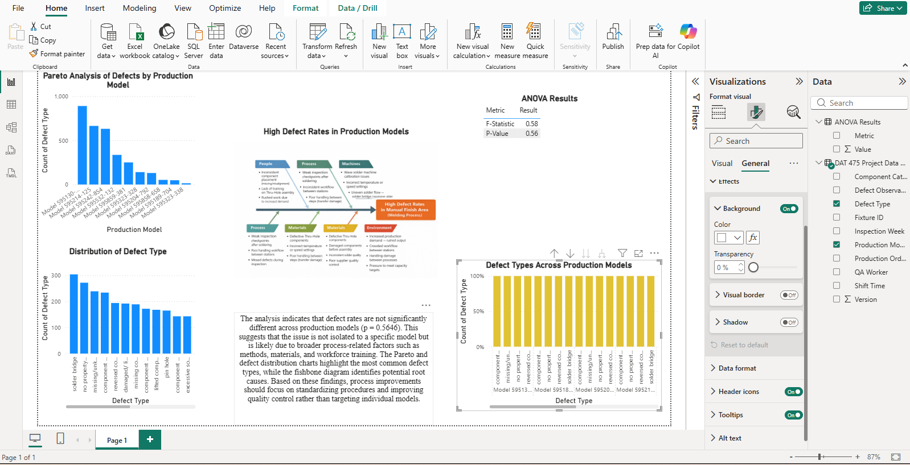

# Manufacturing Defect Analysis Dashboard

## Overview
This project analyzes manufacturing defects using Power BI to identify patterns, high-risk production models, and opportunities for quality improvement.

## Problem
Manufacturing processes were experiencing recurring defects that impacted product quality and efficiency. There was limited visibility into which production models contributed most to defects.

## Solution
Developed a Power BI dashboard to:
- Track defect types
- Identify high-defect production models
- Visualize trends using Pareto analysis
- Support data-driven decision-making

## Tools Used
- Power BI
- Excel / CSV
- Data Analysis (Pareto, ANOVA)

## Key Features
- Interactive dashboard for defect tracking
- Pareto chart highlighting top defect contributors
- Breakdown of defect types
- Model comparison for performance analysis

## Results
- Identified key contributors to manufacturing defects
- Improved visibility into quality issues
- Enabled data-driven process improvement

## Dashboard Preview

## Files Included
- `Defect-dashboard.pbix` → Power BI dashboard
- `defects_dataset.csv` → dataset used
- `Screenshot...png` → dashboard preview

## Future Improvements
- Add Python-based statistical analysis (ANOVA)
- Automate data processing
- Expand predictive modeling
